# Data model

Postgres on Supabase. The schema lives in [`supabase/migrations/`](../supabase/migrations/) and is tested by [`supabase/tests/`](../supabase/tests/) (`npm run test:db`). Issue: [TYL-7](https://linear.app/tyler-solo/issue/TYL-7/design-core-data-model).

## Diagram

```mermaid
erDiagram
    recipe_sources ||--o{ recipes : publishes
    recipes ||--o{ recipe_ingredients : "has lines"
    recipes ||--o{ recipe_cuisines : ""
    recipes ||--o{ recipe_diets : ""
    cuisines ||--o{ recipe_cuisines : ""
    diets ||--o{ recipe_diets : ""
    ingredients ||--o{ recipe_ingredients : "mapped to"
    ingredients ||--o{ ingredient_aliases : "known as"

    users ||--|| profiles : ""
    users ||--o{ user_diets : ""
    users ||--o{ user_favorite_cuisines : ""
    users ||--o{ user_favorite_ingredients : ""
    users ||--o{ user_disliked_ingredients : ""
    users ||--o{ user_saved_recipes : ""
    users ||--o{ user_pantry_staples : ""

    store_chains ||--o{ stores : ""
    store_chains ||--o{ store_products : sells
    ingredients ||--o{ store_products : "matched to"
    users ||--o{ user_stores : "shops at"
    stores ||--o{ user_stores : ""
    users ||--o{ user_product_choices : ""

    ingredients ||--o{ prices : ""
    store_products ||--o{ prices : ""
    stores ||--o{ prices : ""

    users ||--o{ meal_plans : ""
    meal_plans ||--o{ meal_plan_entries : ""
    recipes ||--o{ meal_plan_entries : ""
    users ||--o{ shopping_lists : ""
    meal_plans ||--o| shopping_lists : generates
    shopping_lists ||--o{ shopping_list_items : ""

    recipes {
        uuid id PK
        text source_url UK
        text title
        jsonb instructions "only if rights allow"
        text visibility "public | private"
        text status "active | needs_review | hidden | removed"
    }
    recipe_ingredients {
        uuid recipe_id FK
        smallint line_no "same line = alternatives"
        smallint option_no
        text raw_text
        uuid ingredient_id FK "null until mapped"
        numeric quantity
        numeric quantity_max "ranges"
        text unit
        bool is_optional
    }
    ingredients {
        uuid id PK
        text name UK
        text aisle
        text[] contains "meat, fish, dairy, gluten..."
        numeric grams_per_cup
        numeric grams_per_each
    }
    diets {
        text slug PK
        text[] excludes
    }
    prices {
        uuid id PK
        text source "user | store_api | deal | baseline_*"
        uuid ingredient_id FK
        uuid store_product_id FK
        uuid store_id FK "null = baseline"
        uuid user_id FK "only for user prices"
        int price_cents
        numeric quantity
        text unit
        date valid_to "deals"
    }
    profiles {
        uuid user_id PK
        int weekly_budget_cents
        smallint household_size
        text home_zip
        text[] allergens
    }
    meal_plans {
        uuid id PK
        uuid user_id FK
        date week_start
        int budget_cents
    }
    shopping_list_items {
        uuid shopping_list_id FK
        text name
        numeric quantity
        int est_price_cents "snapshot"
        text price_source
        timestamptz checked_at
    }
```

## Key decisions

### Diet labels come from ingredients

- Every canonical ingredient lists what it **contains** (`meat`, `poultry`, `fish`, `shellfish`, `gelatin`, `dairy`, `egg`, `honey`, `gluten`, `tree_nut`, `peanut`, `soy`, `sesame`).
- Each diet lists what it **excludes**. Vegetarian excludes meat, poultry, fish, shellfish and gelatin; vegan also excludes dairy, egg and honey. Adding a diet is a data change, not a code change.
- `recipe_meets_diet(recipe, diet)` decides. It returns:
  - **true** when every required line has at least one option that fits;
  - **false** when some line has no option that fits;
  - **null** when it can't tell (an option isn't mapped to a canonical ingredient yet). Unknown recipes get no label rather than a wrong one.
- Results are stored in `recipe_diets` with where they came from (`derived`, `publisher`, `manual`).

### Diet customization

Users get three kinds of control (TYL-32):

- **Hard rules** filter recipes out. They combine the user's diet presets (`user_diets`), extra categories to avoid on top of those (`profiles.avoid_categories`, e.g. vegetarian + `animal_rennet`), and allergies (`profiles.allergens`). Presets now include no red meat, no pork, no alcohol and shellfish-free.
- **"May contain"** (`ingredients.may_contain`) marks uncertainty: Parmesan may use animal rennet, flour tortillas may use lard. A recipe that only fits if the right product is bought gets a **check-the-label** status instead of being hidden. Users can switch to leaving such recipes out (`profiles.strict_may_contain`). Allergies are always strict.
- **Soft goals** (`user_diet_goals`) are planner targets that hide nothing: specific days ("Meatless Mondays": vegetarian dinners on day 1) or a weekly count ("4 vegetarian dinners a week").
- **Weights** (`user_category_weights`) nudge recommendations: −1 (much less) to +1 (much more) per category, e.g. `meat` at −0.5.

`recipe_fit_for_user(recipe, user)` returns `fits`, `check_label`, `unknown` or `excluded`, built on `recipe_rule_status(recipe, excludes, strict)`. Recipe diet labels (`recipe_meets_diet`) are only earned by a clear `fits`.

### Alternatives and ranges

- One row in `recipe_ingredients` per ingredient **option**. "2 tbsp fish sauce (or soy sauce)" becomes two rows on the same `line_no`, so the recipe still counts as vegetarian.
- `quantity` and `quantity_max` hold ranges ("1–2 tbsp").
- Optional lines are ignored for diet checks; the planner should leave out optional ones that break a user's diet.

### One price table for every source

- `prices` holds user entries, Kroger store prices, deals, and BLS/USDA baselines, each tagged with `source`.
- A row means "`price_cents` buys `quantity` `unit`" (249 for 14 oz), so package prices and unit prices fit the same shape.
- Lookup order per ingredient and store: **user → store_api → deal → baseline** (TYL-13, TYL-28). That logic lives in the API.
- User-entered prices are private to the user (RLS).
- Shopping list items keep a **snapshot** of the price and its source, so the total doesn't change mid-shop.

### Baseline prices

- `supabase/migrations/20261007030000_baseline_prices.sql` seeds 105 ingredients with a baseline price each. It's generated by `apps/api/scripts/build_baseline_prices.py`; edit the script, not the SQL.
- Sources: BLS average prices for the South (staples, last published January 2025), USDA ERS fruit and vegetable prices (national, 2023), both adjusted to the latest CPI "food at home" index, plus `apps/api/data/seed_prices.csv`, a short list of rough hand estimates for items neither source covers (tofu, spices, oils).
- The API's `app/pricing/estimate.py` picks a price per ingredient and store in the lookup order above and converts units (cups, pounds, each) using each ingredient's `grams_per_cup` and `grams_per_each`.
- Re-run the script to refresh prices; a scheduled job can replace it later.

### Recipe content rights

- `recipe_sources.content_rights` is `link_only` by default: we keep metadata and ingredients and link out for instructions. `instructions` is only filled for `public_domain` or `licensed` sources, or a user's own private recipe. Full rules: [policies/recipe-sources.md](policies/recipe-sources.md) (TYL-27).
- `opted_out_at` records a site asking to be removed.
- New recipes start as `needs_review` and aren't shown publicly until they're `active`.

### Access (row level security)

- **Catalog** (recipes, ingredients, diets, cuisines, stores, products, shared prices): readable by anyone, written only by the API using the service role.
- **Recipes:** anyone sees public `active` ones; users also see recipes they added. Ingredient lines, cuisines and diet labels follow their recipe.
- **User data** (profile, favorites, plans, lists, own prices, own stores): only the owner can read or write.

### Other choices

- Money is integer cents. IDs are UUIDs. Timestamps are `timestamptz`.
- Recipes are never deleted (`status = removed`), so old meal plans keep working.
- Cuisines, diets and store chains are lookup tables seeded in the migration.
- Recipe search uses a Postgres full-text index on title and summary to start.

## Not modeled yet

- **Households:** sharing a plan or list with family (TYL-18). Plans and lists are per user for now; adding a `household_id` later is straightforward.
- **Nutrition** (TYL-11, after v1).
- **Crawl run history:** only `last_crawled_at` per source for now.
- **Assistant conversations** (TYL-25).
